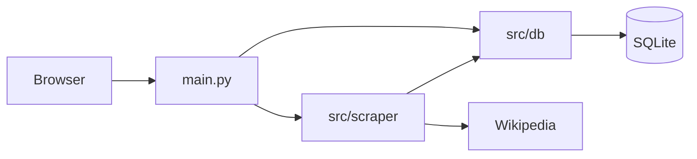

# Office Holder

Local app to build a database of political officeholders by scraping Wikipedia. Run the scraper locally (no Google Colab), manage office configs and party list in a dark-mode UI, and store data in SQLite.

**When you change the codebase:** Update this README when you add/remove major routes or features, move or rename scraper/DB modules, or change run modes, preview behavior, or debug export. Keep the "Architecture" and "How the scraper works" sections in sync with the code so Cursor and future edits can rely on it.

---

## Setup

1. **Clone and enter the project**
   ```bash
   cd office_holder
   ```

2. **Create a virtual environment (recommended)**
   ```bash
   python -m venv venv
   # Windows:
   venv\Scripts\activate
   # macOS/Linux:
   source venv/bin/activate
   ```

3. **Install dependencies**
   ```bash
   pip install -r requirements.txt
   ```

4. **Run the app**
   ```bash
   uvicorn src.main:app --reload
   ```
   Open http://127.0.0.1:8000

---

## Architecture



- **`src/main.py`** — FastAPI app: all HTTP routes (offices, parties, run, individuals, office terms), form handlers, and API endpoints (preview, test-config, debug export, preview-offices). Builds office draft from JSON via `_office_draft_from_body()` for test-config and preview.
- **`src/db/`** — SQLite layer: `connection.py` (path, init, get_connection), `offices.py`, `parties.py`, `refs.py` (countries, states, levels, branches), `individuals.py`, `office_terms.py`, `bulk_import.py`, `migrate.py`, `schema.py`, `date_utils.py`. Shared `_row_to_dict` in `db/utils.py`.
- **`src/scraper/`** — Parsing and run: `runner.py` (run_with_db, preview_with_config), `table_parser.py` (DataCleanup, Offices, Biography), `parse_core.py` (re-exports from table_parser; sample file is not used at runtime), `config_test.py` (test_office_config, get_raw_table_preview, get_all_tables_preview, get_table_html), `logger.py` (Logger, HTTP_USER_AGENT).

---

## How the scraper works

- **Run modes** (implemented in `src/scraper/runner.py`):
  - **Full run:** Clears office terms (and optionally individuals), then parses all enabled offices and writes to DB.
  - **Delta run:** Parses all office tables, compares with existing terms, inserts/updates only changes.
  - **Live person update:** Refreshes biography data for individuals with no death date.
  - **Single-bio:** Run biography for one individual (by ID or Wikipedia URL).
  - **Selected bios by office category:** Pick an office category, optionally limit to no-death-date individuals and/or only valid page paths (non-blank page_path), and run biography refresh for matching IDs.

- **Table parsing:** Done by `src/scraper/table_parser.py` (classes DataCleanup, Offices, Biography). **The app does not load or execute `sample files/` at runtime.** `src/scraper/parse_core.py` only imports and re-exports from `table_parser`. Column mapping, rowspan handling, dynamic parse, and term-date extraction all live in table_parser.

- **Config test and preview:**
  - `src/scraper/config_test.py`: `test_office_config(office_row)` validates URL, table_no, and column indices; `get_raw_table_preview`, `get_all_tables_preview`, `get_table_html` fetch and return raw table data or HTML for the UI.
  - `runner.preview_with_config(office_row, max_rows=10)` runs the full parser (table_parser) for one office and returns `preview_rows`, `raw_table_preview`, `error`.

---

## Key endpoints and features

| Route / feature | Purpose |
|-----------------|--------|
| `GET /`, `GET /offices` | List offices (with filters, show limit, test all, preview all). |
| `GET/POST /offices/new`, `GET/POST /offices/{id}` | Create/update office config. |
| `GET /api/offices/{id}/test-config` | Test saved config for one office. |
| `POST /api/offices/test-config` | Test draft config from JSON body. |
| `POST /api/preview` | Preview with draft config (JSON body); returns parsed rows. |
| `POST /api/preview-all-tables` | Fetch URL, return all tables (top 10 rows each); confirm if many tables. |
| `POST /api/raw-table-preview` | Fetch URL, return raw cell text for the single table at `table_no` (top 10 rows; no mapping). |
| `POST /api/table-html` | Fetch URL, return raw HTML of table at `table_no`. |
| `POST /api/office-debug-export` | Write debug file (config + extracted table + raw HTML) to `debug/`. |
| `POST /api/preview-offices` | Body: `{ "office_ids": [...] }`. Runs top-10 preview for each using saved config; used by "Preview all" on offices list. |
| `GET /ui-test-scripts`, `POST /api/ui-test-scripts/run/start`, `GET /api/ui-test-scripts/run/status/{job_id}` (plus legacy `POST /api/ui-test-scripts/run`) | Open UI test runner in a new tab/window, auto-run Playwright UI tests, and show per-test results + raw output. |
| `GET /parties`, `/parties/new`, etc. | Parties CRUD and bulk import. |
| `GET /run`, `POST /run` | Run page: start job (full/delta/live_person/single/category-select), poll progress. |
| `GET /api/run/matching-individuals` | For run-page category bio mode: returns matching record + individual counts for selected filters. |
| `GET /data/individuals`, `GET /data/office-terms` | View individuals and office terms. |

---

## Data and config

- **SQLite:** `data/office_holder.db` (created on first request). Path and log dir from `src/db/connection.py`.
- **Logs:** Under `data/` or project log dir; used by scraper runs and test run.
- **Debug exports:** Written to `debug/` at project root (gitignored); filename `{OfficeName}_{timestamp}.txt`.
- **`.gitignore`:** `data/`, `debug/`, `*.db`, `logs/`, etc. `sample files/` is tracked for reference and bulk-import CSV.

---

## Using the UI

- **Offices:** Add/edit office configs (Wikipedia list URL, table number, column mapping, flags). Includes an optional per-table row filter (`filter_column` + `filter_criteria`) to only parse rows whose selected column text contains the criteria. Use **Bulk import** with a path like `sample files/OfficeTables - Sheet1 (1).csv` to load many at once. **Test config**, **Preview**, **Show all tables**, **Show selected table** (raw cell text for the configured table only), **Show table HTML**, **Export debug file** use the current form values.
- **Parties:** Manage the party list (country, name, Wikipedia link) used when resolving party from table links.
- **Run:** Choose run mode (Full / Delta / Live person / Single bio / Category bio selection), pick office category filters when relevant, and run. Category bio selection shows match counts before run and supports force update plus valid page-path filtering.
- **Individuals / Office terms:** View scraped data.

---


## Parser test manifest workflow

### Test scripts

- Validate parser fixtures before commit or deploy:
  ```bash
  python scripts/validate_parser_fixtures.py
  ```
- Optional: validate a custom manifest path:
  ```bash
  python scripts/validate_parser_fixtures.py path/to/parser_tests.json
  ```
- The validator checks required manifest keys, verifies `html_file` fixture paths exist, and enforces that `config_json` and `expected_json` are JSON objects/arrays. It exits non-zero with per-entry error messages when any fixture row is broken.

- Canonical parser test manifest: `test_scripts/manifest/parser_tests.json`.
- Each manifest row includes: `name`, `test_type`, `html_file`, `source_url`, `config_json`, `expected_json`, `enabled`.
- `html_file` must point to a committed local fixture path (for example `test_scripts/fixtures/...`) relative to the project root. Import validation rejects missing or absolute paths.
- On app startup, `init_db()` seeds `parser_test_scripts` from the manifest **only when the DB table is empty**.
- Conflict behavior is deterministic:
  - Existing DB rows are not overwritten during startup seeding.
  - Manifest updates do not auto-merge into non-empty DBs.
  - To apply manifest updates to an existing DB, run explicit import with `overwrite_existing=True` in `src/db/test_scripts.py`.
  - To publish DB edits back into source control, run explicit export from DB to the manifest (`export_manifest_from_db`).

## Windows PowerShell quick commands

Use these command forms in **PowerShell** (not bash syntax):

```powershell
# Run targeted tests
$env:PYTHONPATH = "."
python -m pytest -q src/scraper/test_infobox_role_key.py src/scraper/test_script_runner.py

# If pytest command/module is missing
python -m pip install pytest

# Read one table config by office_table_config.id
Invoke-RestMethod -Method GET -Uri "http://127.0.0.1:8000/api/table-configs/880"

# Save infobox_role_key directly by office_table_config.id
$body = @{ infobox_role_key = "senior judge" } | ConvertTo-Json
Invoke-RestMethod -Method POST -Uri "http://127.0.0.1:8000/api/table-configs/880/set-infobox-role-key" -ContentType "application/json" -Body $body

# POST page form data (same route used by the UI page form)
$form = @{ url = "https://en.wikipedia.org/wiki/District_Court_for_the_Northern_Mariana_Islands"; country_id = 1 }
Invoke-WebRequest -Method POST -Uri "http://127.0.0.1:8000/pages/876" -Form $form -MaximumRedirection 0

# Cross-platform CLI helper (works in PowerShell/cmd/bash)
python scripts/infobox_role_key_cli.py --base-url http://127.0.0.1:8000 --table-config-id 880 --role-key "senior judge"
```

Notes:
- `PYTHONPATH=. pytest ...` is bash syntax and will fail in PowerShell.
- `GET ...` is not a PowerShell command; use `Invoke-RestMethod`.
- PowerShell does not support bash-style `&&` in older versions; run commands on separate lines (or use `;`).
- `POST ...` / `GET ...` are not PowerShell commands; use `Invoke-RestMethod` or `Invoke-WebRequest` with `-Method`.
- In PowerShell, `curl` is an alias for `Invoke-WebRequest` (not GNU curl syntax). Use `curl.exe` if you want native curl flags like `-X`.

---

## Git and data

- Repo is safe to refresh: `data/`, `*.db`, `logs/`, and `debug/` are in `.gitignore`. Your DB, logs, and debug exports are not removed on pull.
- `sample files/` is tracked so the sample script and CSV stay in the repo.
